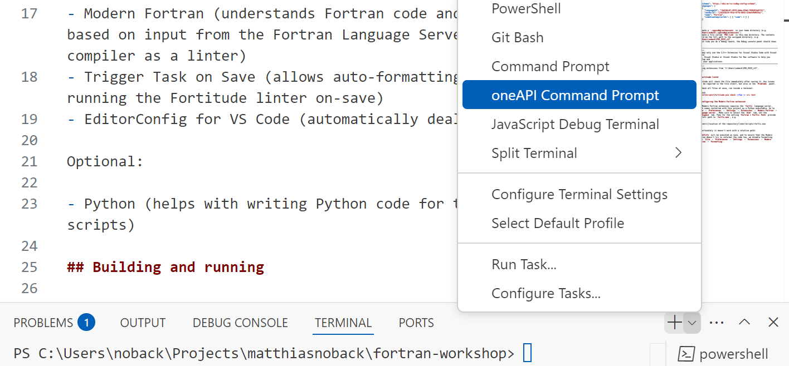
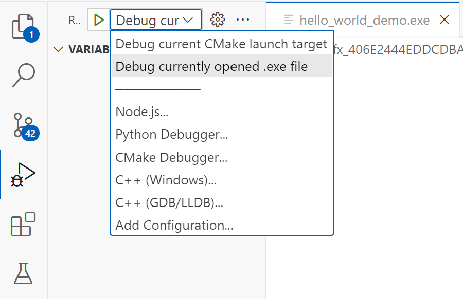

# README for VS Code with FPM

## Setup

Requirements:

- Intel oneAPI Fortran Essentials [Download here](https://www.intel.com/content/www/us/en/developer/tools/oneapi/fortran-compiler-download.html)
- Make sure the oneAPI bin folder is in your `PATH` environment variable (e.g. `C:\Program Files (x86)\Intel\oneAPI\compiler\latest\bin`)
- Fortran Package Manager (FPM) [Installation instructions](https://fpm.fortran-lang.org/install/index.html)
- Python 3 [Download here](https://www.python.org/downloads/)
- Visual Studio Code IDE [Download here](https://code.visualstudio.com/download).

Start VS Code, and open the folder where you've cloned this project to.

Open the `Extensions` panel on the left (or press `Ctrl + Shift + X`). Then install the following extensions:

- Modern Fortran (understands Fortran code and gives code completion based on input from the Fortran Language Server, etc., runs the compiler as a linter)
- Trigger Task on Save (allows auto-formatting with fprettify and running the Fortitude linter on-save)
- EditorConfig for VS Code (automatically deals with whitespacing)

Optional:

- Python (helps with writing Python code for the output visualization scripts)

### Python dependencies

From the workspace folder, run:

```bash
python -m venv venv
.\venv\activate.bat
pip install -r requirements.txt
```

## Building and running

Work from the oneAPI command prompt. On Windows you can open this prompt via the Terminal panel. Press the downward-arrow next to the plus icon and select oneAPI Command Prompt:



Now you can run:

```bash
fpm run hello_world_demo
```

To show a list of executables to run:

```bash
fpm run --list
```

FPM will automaticaly build the executables with the ifx compiler.

## Tests

To run all tests:

```bash
fpm test
```

Or a specific test suite:

```bash
fpm test -- hello_world
```

## Debugging (optional)

Debugging is a bit messy. First look for the executable you want to debug in the `build/dependencies/` folder (or run for instance `fpm run hello_world_demo --runner` to find out the path of the `.exe` file). Open the `.exe` file in the editor (no need to show its binary contents). Then open the debugger panel on the left, select "Debug currently opened .exe file" and press the Play button in front of it. Make sure to set an actual breakpoint somewhere in your Fortran code.



To improve the debugger's understanding of Fortran code and application memory, follow [these instructions](VS-Code-Fortran-Debugging.md).

## Configuring the Modern Fortran extension

The Modern Fortran extension needs some [manual configuration steps](VS-Code-Modern-Fortran.md).
